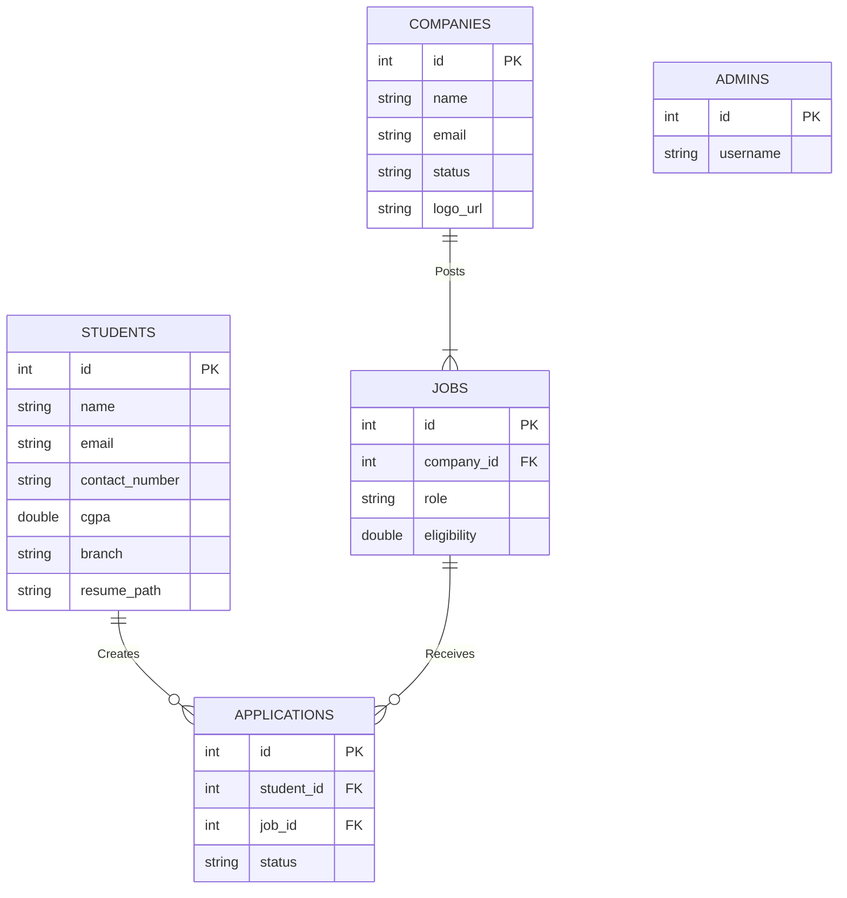
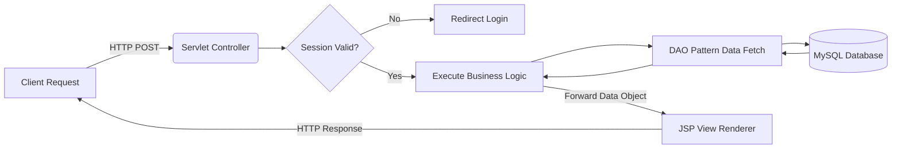
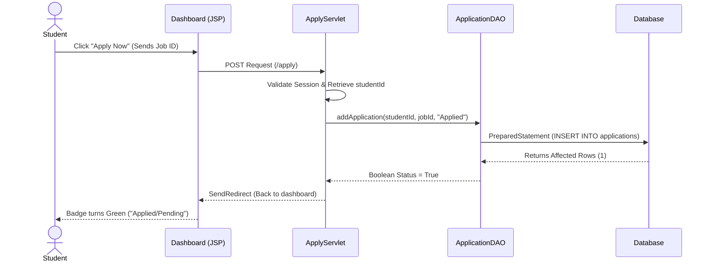

# 📋 Ignite Placement Portal - Comprehensive Project Report

## 1. Executive Summary
**Ignite Placement Portal** is an end-to-end web application developed to bridge the gap between students seeking employment and college administration managing placement drives. The platform securely manages applicant tracking, profile curation, and recruitment logic through a scalable backend and highly responsive, modern Front-End.

---

## 2. Software Development Life Cycle (SDLC)
This project was driven by the **Agile Iterative Model**, focusing on continuous integration and refinement of core features based on immediate feedback loops.

| Phase | Activities Performed |
|-------|----------------------|
| **1. Requirement Analysis** | Identified the primary actors (Students, Admin, & Recruiters). Defined features: secure login, job posting, applicant reviewing, file management (Resume/Profile Pics), Admin approval workflow for companies, and real-time statistics. |
| **2. Design & Architecture** | Created a cohesive, professional UI/UX using Glassmorphism. Expanded Database Schema for Role-Based Access Control (Admin vs. Recruiter). |
| **3. Implementation** | *Iteration 1*: Core Database and User Registration.<br>*Iteration 2*: Admin & Student core workflows.<br>*Iteration 3*: Developed CGPA gating and application tracking.<br>*Iteration 4*: Integrated Recruiter authentication and application review flow.<br>*Iteration 5*: Developed Admin approval workflow for Companies and integrated Chart.js for data visualization. |
| **4. Testing** | Performed unit testing on User authentication logic, validated file-upload restrictions, handled NullPointerExceptions gracefully, and ensured secure URL manipulations. |
| **5. Deployment** | Ready for containerization using Tomcat Web Servers and scalable hosting (AWS/DigitalOcean). |

---

## 3. Web Architecture & Setup (Servlets / JSP Framework)

*Note: While modern systems heavily leverage Spring Boot, this framework intentionally utilizes core **Jakarta EE Servlets & JSP**. This raw **Java EE** approach ensures zero-overhead, highly optimized execution, mimicking the underlying mechanics of Spring MVC.*

### Core Mechanism:
1. **Dispatcher (Controller layer):** `HttpServlet` implementations intercept incoming requests (e.g. `LoginServlet`, `AddJobServlet`). 
2. **Form Data Extraction:** Servlets manipulate the incoming `HttpServletRequest` objects, capturing query parameters.
3. **Session Management:** Tracks ongoing user states via `HttpSession`.
4. **View Resolution (JSP layer):** Java outputs dynamically inject into HTML Views directly, evaluating `if/else` control blocks instantly on the server before generating purely static, secure HTML arrays for the browser.

---

## 4. Model-View-Controller (MVC) Directory Structure

The internal system is strictly decoupled. If developers wish to migrate to Spring Boot in the future, the directory tree is already optimized for a 1:1 transaction.

```text
src/main/
├── java/com/placement/
│   ├── controller/      # Controllers (Servlets routing logic & handling endpoints)
│   ├── dao/             # Data Access Objects (Interfaces defining DB interaction)
│   ├── dao/impl/        # Query Executions (JDBC connections and statements)
│   ├── model/           # Domain/Entities (POJOs representing table rows)
│   └── util/            # Configurations (DBConnection factory)
└── webapp/
    ├── css/             # Styles & Design Tokens
    ├── jsp/             # Views (JSP Files rendering the UI dynamically)
    └── uploads/         # Server-storage for PDF resumes & avatars
```

---

## 5. UI Preferences & Visual Design
Instead of relying on boilerplate frameworks (like Bootstrap), the project takes a bespoke **Premium CSS** approach.

*   **Design Philosophy**: "Glassmorphism" combined with clean card-based layouts. 
*   **Color Palette**: Minimalist, high contrast themes. Deep Navy/Slate `(#0f172a)` for Administrative power-views. Vibrant Blue `(#3b82f6)` for Student portals. 
*   **Typography**: `Inter` Font Family (Google Fonts) for ultra-legible, modern sans-serif scaling.
*   **Icons**: Integrated `Remix Icon` web-font for lightweight vector crispness.
*   **Interactivity**: Soft gradients, transition times of `0.2s`, and hover-elevations `translateY(-2px)` implemented on standard buttons to generate high user satisfaction.

---

6.  **End-to-End System Workflow**

1.  **Authentication Gateway**: User approaches `index.jsp` and selects their portal (Student, Recruiter, or Admin). They authenticate; the system queries MySQL to validate credentials and initiates a `session`.
2.  **Company Onboarding**: New recruiters register their company. Their account remains **Pending** until an Administrator reviews and approves the registration via the Admin Dashboard.
3.  **Administrative Actions**: The Admin manages students, reviews pending company registrations, and oversees all placement drives. They can post new jobs or monitor application statistics.
4.  **Student Discovery & Application**: The Student logs in. The dashboard intelligently filters jobs running conditional logic against their `CGPA`. The student can upload their resume and apply for eligible roles.
5.  **Recruiter Management**: Once approved, recruiters can view students who have applied for their job postings, download/view student resumes, and update application statuses to "Selected" or "Rejected".

---

## 7. Database Planning & Schema (ERD)

The relational integrity avoids duplication through distinct mapping.



---

## 8. Architectural Diagrams (UML & Flow)

### High-level Flowchart Diagram
Visualizing the HTTP transaction state-machine.



### Application Sequence Definition
Visual interaction flow between objects when applying for an internship role.



---

## 9. Implemented Advanced Features
*   **Data Visualization Engine**: Integrated `Chart.js` on the Admin dashboard to visually map application statistics (Selected vs. Pending vs. Rejected), providing real-time hiring insights.
*   **Dynamic Status Tracking**: Applications now features live status badges and conditional UI logic that locks actions once a decision has been finalized.
*   **Secure File Review**: Direct integration for viewing student resumes in-browser for recruiters, streamlining the interview pipeline.

## 10. Future Implementation Ideas & Scalability
*   **Mail Verification System**: Implement `JavaMail API` (SMTP) to send outgoing emails to students automatically when an Admin or Recruiter shifts their application status.
*   **Spring Boot Migration**: Migrating to Spring Boot's `RestController` and `Spring Data JPA` to eliminate JDBC boilerplate.
