# 🏛 System Architecture & Design

Ignite Placement Portal follows the classic **Model-View-Controller (MVC)** architectural pattern with a layered architecture to ensure clear separation of concerns, codebase maintainability, scalability, and security.

## 📋 Core Diagrams (COMPLETE GUIDE)

### Quick Navigation

🎯 **MUST-HAVE DIAGRAMS:**
- **[1. Use Case Diagram](#1-use-case-diagram)** - Shows all actors (Student/Admin/Recruiter) and their actions
- **[2. Activity Diagram](#2-activity-diagram-workflow)** - Complete placement process workflow
- **[3. Data Flow Diagram](#3-data-flow-diagram-level-0--1)** - Information flow through system
- **[4. Layered Architecture](#4-system-architecture-layered)** - Browser → Servlet → DAO → MySQL
- **[5. MVC Pattern](#5-system-architecture-mvc-pattern)** - Model-View-Controller flow
- **[6. Class Diagram](#6-uml-class-diagram-java-objects)** - Java object relationships
- **[7. ER Diagram](#7-database-er-diagram-entity-relationships)** - Database schema (6 tables)
- **[8. Component Diagram](#8-component-diagram-system-parts)** - System components
- **[9. Deployment Diagram](#9-deployment-diagram-runtime-environment)** - Production setup
- **[10. Sequence Diagrams](#10-sequence-diagrams-step-by-step-flows)** - 4 key workflows

✨ **ADVANCED DIAGRAMS:**
- **[11. State Diagrams](#11-state-diagrams-status-transitions)** - Status changes
- **[12. API Flow Diagram](#12-api-flow-diagram)** - Request routing
- **[13. Performance & Scalability](#13-performance--scalability-strategies)** - Optimization strategies

---

## 1. USE CASE DIAGRAM ⭐

Shows all actors and their interactions with the system.


```mermaid
graph TB
    subgraph "Ignite Placement Portal"
        Register["📝 Register"]
        Login["🔐 Login"]
        ViewJobs["👀 View Available Jobs"]
        Apply["📤 Apply for Job"]
        ViewStatus["📊 View Application Status"]
        Upload["📁 Upload Resume/Photo"]
        
        AdminLogin["🔐 Admin Login"]
        AdminReg["📝 Admin Register"]
        ApproveCompany["✅ Approve Companies"]
        PostJob["✍️ Post Job"]
        ViewApplicants["👥 View Applicants"]
        UpdateStatus["✏️ Update App Status"]
        ViewAnalytics["📈 View Analytics (Chart.js)"]
        
        CompRegister["📝 Recruiter Register"]
        CompLogin["🔐 Recruiter Login"]
        ReviewApps["👁️ Review Applicants"]
        ViewResume["📄 View Resumes"]
    end
    
    Student["👨‍🎓 Student"]
    Admin["🔧 Administrator"]
    Recruiter["🏢 Recruiter"]
    System["🗄️ System"]
    
    Student -->|Register/Login| Register
    Student -->|Browse/Apply| ViewJobs
    Student -->|Manage| Upload
    
    Admin -->|Login/Register| AdminLogin
    Admin -->|Approve| ApproveCompany
    Admin -->|Review| ViewApplicants
    Admin -->|Monitor| ViewAnalytics
    
    Recruiter -->|Register/Login| CompRegister
    Recruiter -->|Review| ReviewApps
    Recruiter -->|Inspect| ViewResume
    Recruiter -->|Hire/Reject| UpdateStatus
```

---

## 2. ACTIVITY DIAGRAM (WORKFLOW) 🔄

Shows the complete workflow from start to finish.

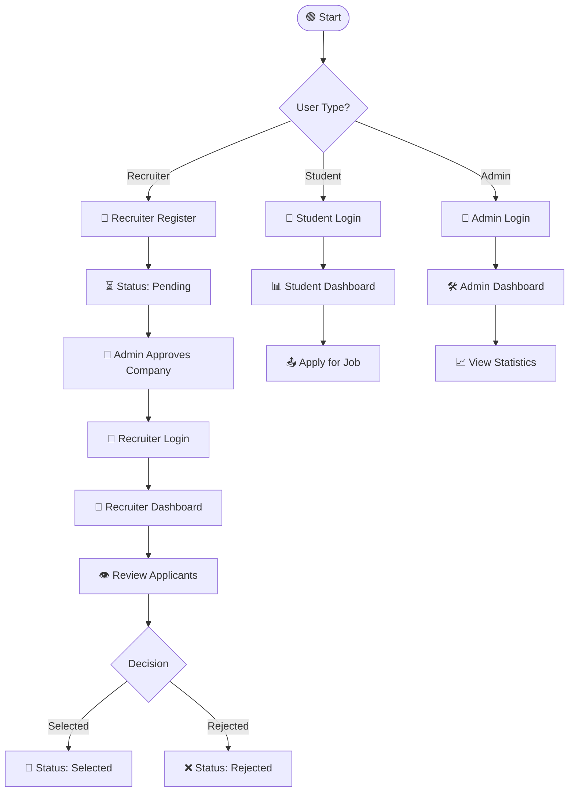
```mermaid
graph TD
    Start([🟢 Start]) --> UserType{User Type?}
    
    UserType -->|Student| SLogin["🔐 Student Login"]
    UserType -->|Recruiter| RReg["📝 Recruiter Register"]
    UserType -->|Admin| ALogin["🔐 Admin Login"]
    
    RReg --> Pending["⏳ Status: Pending"]
    Pending --> AReviewComp["🔧 Admin Approves Company"]
    AReviewComp --> RLogin["🔐 Recruiter Login"]
    
    SLogin --> SDash["📊 Student Dashboard"]
    RLogin --> RDash["🏢 Recruiter Dashboard"]
    ALogin --> ADash["🛠️ Admin Dashboard"]
    
    SDash --> Apply["📤 Apply for Job"]
    RDash --> RReview["👁️ Review Applicants"]
    ADash --> Stats["📈 View Statistics"]
    
    RReview --> Decision{Decision}
    Decision -->|Selected| Selected["🎉 Status: Selected"]
    Decision -->|Rejected| Rejected["❌ Status: Rejected"]
```

---

## 3. DATA FLOW DIAGRAM (LEVEL 0 & 1) 📊

Shows how data flows through the system.

### Level 0 - Context Diagram

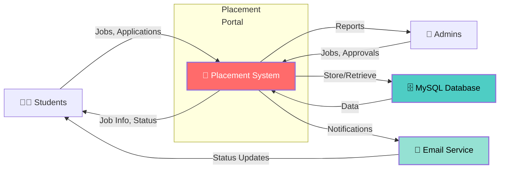
```mermaid
graph LR
    Student["👨‍🎓 Students"]
    Admin["🔧 Admins"]
    
    subgraph "Placement<br/>Portal"
        System["🎯 Placement System"]
    end
    
    Database["🗄️ MySQL Database"]
    Email["📧 Email Service"]
    
    Student -->|Jobs, Applications| System
    Admin -->|Jobs, Approvals| System
    System -->|Job Info, Status| Student
    System -->|Reports| Admin
    System -->|Store/Retrieve| Database
    Database -->|Data| System
    System -->|Notifications| Email
    Email -->|Status Updates| Student
    
    style System fill:#FF6B6B,color:#fff,stroke-width:2px
    style Database fill:#4ECDC4,color:#000,stroke-width:2px
    style Email fill:#95E1D3,color:#000,stroke-width:2px
```

### Level 1 - Detailed Flow

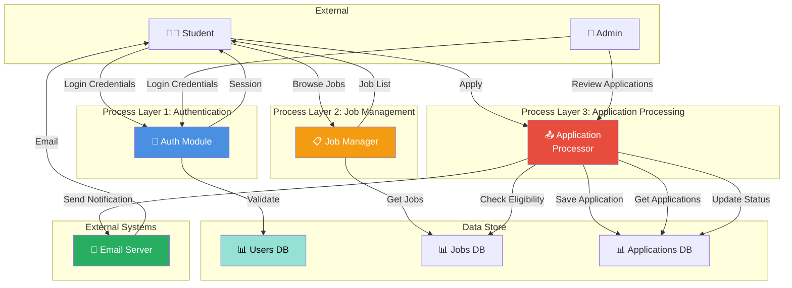
```mermaid
graph TB
    subgraph "External"
        Student1["👨‍🎓 Student"]
        Admin1["🔧 Admin"]
    end
    
    subgraph "Process Layer 1: Authentication"
        Auth["🔐 Auth Module"]
    end
    
    subgraph "Process Layer 2: Job Management"
        JobMgmt["📋 Job Manager"]
    end
    
    subgraph "Process Layer 3: Application Processing"
        AppProc["📤 Application<br/>Processor"]
    end
    
    subgraph "Data Store"
        Users_DB["📊 Users DB"]
        Jobs_DB["📊 Jobs DB"]
        Apps_DB["📊 Applications DB"]
    end
    
    subgraph "External Systems"
        Email1["📧 Email Server"]
    end
    
    Student1 -->|Login Credentials| Auth
    Admin1 -->|Login Credentials| Auth
    Auth -->|Validate| Users_DB
    Auth -->|Session| Student1
    
    Student1 -->|Browse Jobs| JobMgmt
    JobMgmt -->|Get Jobs| Jobs_DB
    JobMgmt -->|Job List| Student1
    
    Student1 -->|Apply| AppProc
    AppProc -->|Save Application| Apps_DB
    AppProc -->|Check Eligibility| Jobs_DB
    
    Admin1 -->|Review Applications| AppProc
    AppProc -->|Get Applications| Apps_DB
    AppProc -->|Update Status| Apps_DB
    
    AppProc -->|Send Notification| Email1
    Email1 -->|Email| Student1
    
    style Auth fill:#4A90E2,color:#fff
    style JobMgmt fill:#F39C12,color:#fff
    style AppProc fill:#E74C3C,color:#fff
    style Users_DB fill:#95E1D3,color:#000
    style Email1 fill:#27AE60,color:#fff
```

---

## 4. System Architecture (LAYERED) - High Level Architecture

This diagram outlines how system components communicate with each other. Requests hit the Controller (Servlets), which invoke the Model (Java Beans & DAO), which communicate with the Database. The results are injected back into the View (JSP).

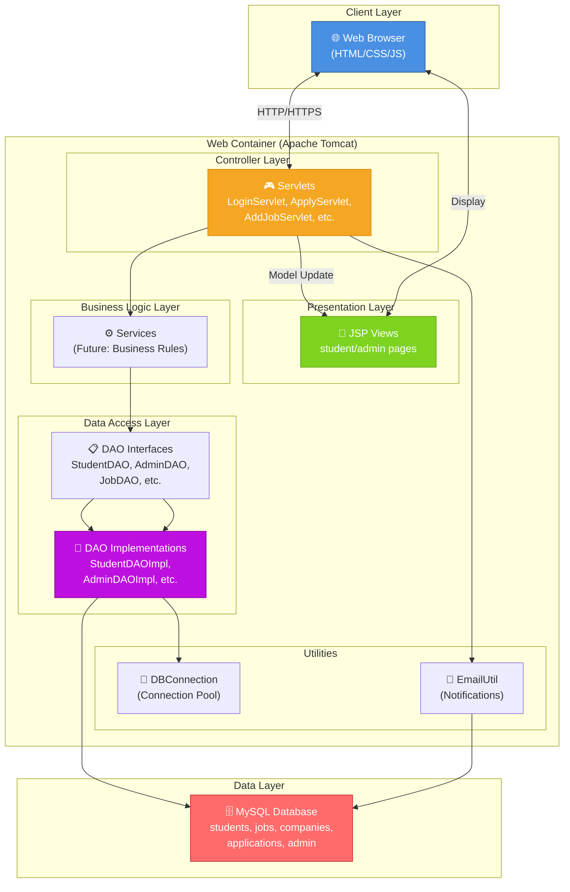
```mermaid
graph TB
    subgraph "Client Layer"
        Browser["🌐 Web Browser<br/>(HTML/CSS/JS)"]
    end
    
    subgraph "Web Container (Apache Tomcat)"
        subgraph "Presentation Layer"
            JSPView["📄 JSP Views<br/>student/admin pages"]
        end
        
        subgraph "Controller Layer"
            Servlets["🎮 Servlets<br/>LoginServlet, ApplyServlet,<br/>AddJobServlet, etc."]
        end
        
        subgraph "Business Logic Layer"
            Services["⚙️ Services<br/>(Future: Business Rules)"]
        end
        
        subgraph "Data Access Layer"
            interfaces["📋 DAO Interfaces<br/>StudentDAO, AdminDAO,<br/>JobDAO, etc."]
            impl["💾 DAO Implementations<br/>StudentDAOImpl,<br/>AdminDAOImpl, etc."]
            interfaces --> impl
        end
        
        subgraph "Utilities"
            DBConn["🔌 DBConnection<br/>(Connection Pool)"]
            Email["📧 EmailUtil<br/>(Notifications)"]
        end
    end
    
    subgraph "Data Layer"
        MySQL["🗄️ MySQL Database<br/>students, jobs, companies,<br/>applications, admin"]
    end
    
    Browser <-->|HTTP/HTTPS| Servlets
    Servlets -->|Model Update| JSPView
    Browser <-->|Display| JSPView
    
    Servlets --> Services
    Services --> interfaces
    interfaces --> impl
    
    impl --> DBConn
    impl --> MySQL
    
    Servlets --> Email
    Email --> MySQL
    
    style Browser fill:#4A90E2,stroke:#2E5C8A,color:#fff
    style Servlets fill:#F5A623,stroke:#D68910,color:#fff
    style JSPView fill:#7ED321,stroke:#5DA015,color:#fff
    style impl fill:#BD10E0,stroke:#7B0499,color:#fff
    style MySQL fill:#FF6B6B,stroke:#C92A2A,color:#fff
```

---

## 5. SYSTEM ARCHITECTURE (MVC PATTERN) - Overview

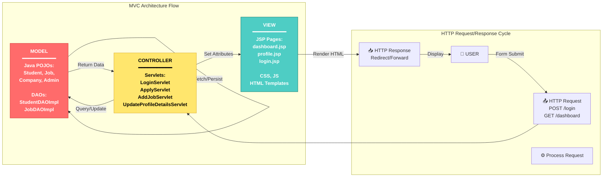
```mermaid
graph LR
    subgraph "MVC Architecture Flow"
        direction LR
        M["<b>MODEL</b><br/>━━━━━━━━━━━<br/>Java POJOs:<br/>Student, Job,<br/>Company, Admin<br/><br/>DAOs:<br/>StudentDAOImpl<br/>JobDAOImpl"]
        V["<b>VIEW</b><br/>━━━━━━━━━━━<br/>JSP Pages:<br/>dashboard.jsp<br/>profile.jsp<br/>login.jsp<br/><br/>CSS, JS<br/>HTML Templates"]
        C["<b>CONTROLLER</b><br/>━━━━━━━━━━━<br/>Servlets:<br/>LoginServlet<br/>ApplyServlet<br/>AddJobServlet<br/>UpdateProfileDetailsServlet"]
    end
    
    subgraph "HTTP Request/Response Cycle"
        direction LR
        User["👤 USER"]
        Request["📤 HTTP Request<br/>POST /login<br/>GET /dashboard"]
        Process["⚙️ Process Request"]
        Response["📥 HTTP Response<br/>Redirect/Forward"]
    end
    
    User -->|Form Submit| Request
    Request --> C
    C -->|Query/Update| M
    M -->|Fetch/Persist| M
    M -->|Return Data| C
    C -->|Set Attributes| V
    V -->|Render HTML| Response
    Response -->|Display| User
    
    style M fill:#FF6B6B,stroke:#C92A2A,color:#fff,font-weight:bold
    style V fill:#4ECDC4,stroke:#006E63,color:#fff,font-weight:bold
    style C fill:#FFE66D,stroke:#DAA520,color:#000,font-weight:bold
```

---

## 6. UML CLASS DIAGRAM (JAVA OBJECTS) 🏗️

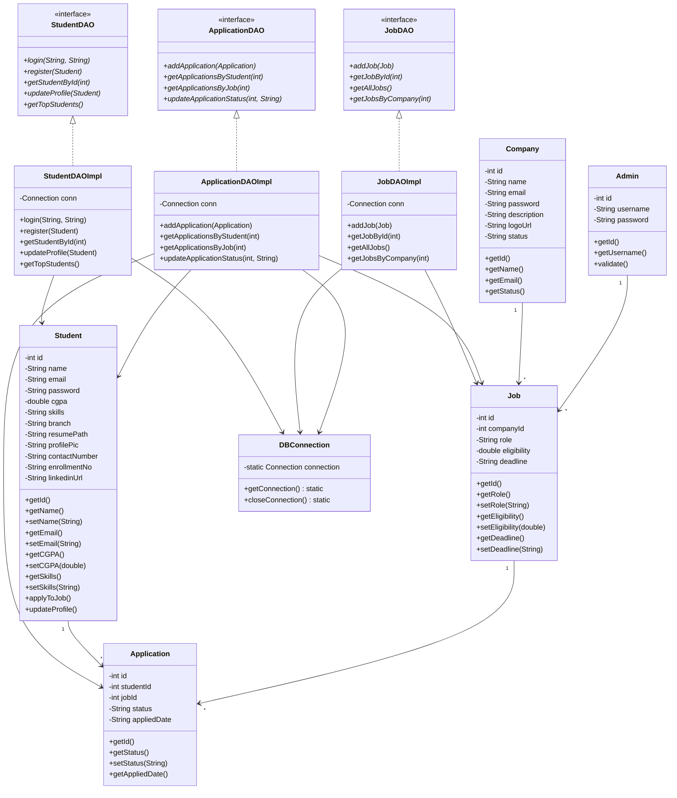
```mermaid
classDiagram
    class Student {
        -int id
        -String name
        -String email
        -String password
        -double cgpa
        -String skills
        -String branch
        -String resumePath
        -String profilePic
        -String contactNumber
        -String enrollmentNo
        -String linkedinUrl
        +getId()
        +getName()
        +setName(String)
        +getEmail()
        +setEmail(String)
        +getCGPA()
        +setCGPA(double)
        +getSkills()
        +setSkills(String)
        +applyToJob()
        +updateProfile()
    }
    
    class Admin {
        -int id
        -String username
        -String password
        +getId()
        +getUsername()
        +validate()
    }
    
    class Company {
        -int id
        -String name
        -String email
        -String password
        -String description
        -String logoUrl
        -String status
        +getId()
        +getName()
        +getEmail()
        +getStatus()
    }
    
    class Job {
        -int id
        -int companyId
        -String role
        -double eligibility
        -String deadline
        +getId()
        +getRole()
        +setRole(String)
        +getEligibility()
        +setEligibility(double)
        +getDeadline()
        +setDeadline(String)
    }
    
    class Application {
        -int id
        -int studentId
        -int jobId
        -String status
        -String appliedDate
        +getId()
        +getStatus()
        +setStatus(String)
        +getAppliedDate()
    }
    
    class StudentDAO {
        <<interface>>
        +login(String, String)*
        +register(Student)*
        +getStudentById(int)*
        +updateProfile(Student)*
        +getTopStudents()*
    }
    
    class JobDAO {
        <<interface>>
        +addJob(Job)*
        +getJobById(int)*
        +getAllJobs()*
        +getJobsByCompany(int)*
    }
    
    class ApplicationDAO {
        <<interface>>
        +addApplication(Application)*
        +getApplicationsByStudent(int)*
        +getApplicationsByJob(int)*
        +updateApplicationStatus(int, String)*
    }
    
    class StudentDAOImpl {
        -Connection conn
        +login(String, String)
        +register(Student)
        +getStudentById(int)
        +updateProfile(Student)
        +getTopStudents()
    }
    
    class JobDAOImpl {
        -Connection conn
        +addJob(Job)
        +getJobById(int)
        +getAllJobs()
        +getJobsByCompany(int)
    }
    
    class ApplicationDAOImpl {
        -Connection conn
        +addApplication(Application)
        +getApplicationsByStudent(int)
        +getApplicationsByJob(int)
        +updateApplicationStatus(int, String)
    }
    
    class DBConnection {
        -static Connection connection
        +getConnection() static
        +closeConnection() static
    }
    
    StudentDAO <|.. StudentDAOImpl
    JobDAO <|.. JobDAOImpl
    ApplicationDAO <|.. ApplicationDAOImpl
    
    StudentDAOImpl --> Student
    StudentDAOImpl --> DBConnection
    
    JobDAOImpl --> Job
    JobDAOImpl --> DBConnection
    
    ApplicationDAOImpl --> Application
    ApplicationDAOImpl --> Student
    ApplicationDAOImpl --> Job
    ApplicationDAOImpl --> DBConnection
    
    Student "1" --> "*" Application
    Job "1" --> "*" Application
    Company "1" --> "*" Job
    Admin "1" --> "*" Job
```

---

## 7. DATABASE ER DIAGRAM (ENTITY RELATIONSHIPS) 🗄️

### Complete Entity-Relationship Diagram

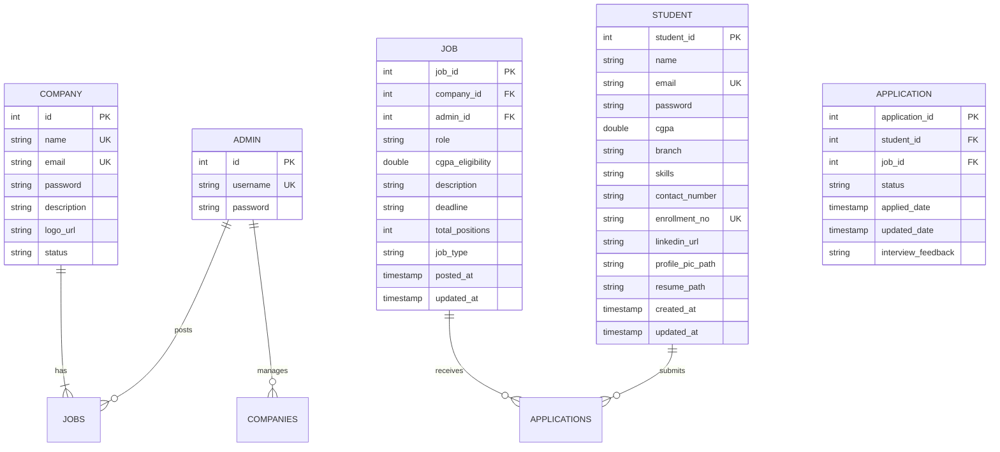
```mermaid
erDiagram
    ADMIN ||--o{ JOBS : "posts"
    ADMIN ||--o{ COMPANIES : "manages"
    COMPANY ||--|{ JOBS : "has"
    STUDENT ||--o{ APPLICATIONS : "submits"
    JOB ||--o{ APPLICATIONS : "receives"

    ADMIN {
        int id PK
        string username UK
        string password
    }

    COMPANY {
        int id PK
        string name UK
        string email UK
        string password
        string description
        string logo_url
        string status
    }

    STUDENT {
        int student_id PK
        string name
        string email UK
        string password
        double cgpa
        string branch
        string skills
        string contact_number
        string enrollment_no UK
        string linkedin_url
        string profile_pic_path
        string resume_path
        timestamp created_at
        timestamp updated_at
    }

    JOB {
        int job_id PK
        int company_id FK
        int admin_id FK
        string role
        double cgpa_eligibility
        string description
        string deadline
        int total_positions
        string job_type
        timestamp posted_at
        timestamp updated_at
    }

    APPLICATION {
        int application_id PK
        int student_id FK
        int job_id FK
        string status
        timestamp applied_date
        timestamp updated_date
        string interview_feedback
    }
```

### Database Schema Details

```sql
-- ADMIN Table
CREATE TABLE admin (
    admin_id INT PRIMARY KEY AUTO_INCREMENT,
    email VARCHAR(100) UNIQUE NOT NULL,
    password VARCHAR(255) NOT NULL,
    name VARCHAR(100) NOT NULL,
    created_at TIMESTAMP DEFAULT CURRENT_TIMESTAMP
);

-- COMPANY Table
CREATE TABLE companies (
    company_id INT PRIMARY KEY AUTO_INCREMENT,
    name VARCHAR(150) UNIQUE NOT NULL,
    description TEXT,
    logo_url VARCHAR(255),
    website VARCHAR(255),
    created_at TIMESTAMP DEFAULT CURRENT_TIMESTAMP
);

-- JOB Table
CREATE TABLE jobs (
    job_id INT PRIMARY KEY AUTO_INCREMENT,
    company_id INT NOT NULL,
    admin_id INT NOT NULL,
    role VARCHAR(100) NOT NULL,
    cgpa_eligibility DOUBLE DEFAULT 0.0,
    description TEXT,
    deadline DATE,
    total_positions INT DEFAULT 1,
    job_type VARCHAR(50),
    posted_at TIMESTAMP DEFAULT CURRENT_TIMESTAMP,
    updated_at TIMESTAMP DEFAULT CURRENT_TIMESTAMP ON UPDATE CURRENT_TIMESTAMP,
    FOREIGN KEY (company_id) REFERENCES companies(company_id) ON DELETE CASCADE,
    FOREIGN KEY (admin_id) REFERENCES admin(admin_id) ON DELETE CASCADE
);

-- STUDENT Table
CREATE TABLE students (
    student_id INT PRIMARY KEY AUTO_INCREMENT,
    name VARCHAR(100) NOT NULL,
    email VARCHAR(100) UNIQUE NOT NULL,
    password VARCHAR(255) NOT NULL,
    cgpa DOUBLE DEFAULT 0.0,
    branch VARCHAR(50),
    skills VARCHAR(255),
    contact_number VARCHAR(15),
    enrollment_no VARCHAR(50) UNIQUE,
    linkedin_url VARCHAR(255),
    profile_pic_path VARCHAR(255),
    resume_path VARCHAR(255),
    created_at TIMESTAMP DEFAULT CURRENT_TIMESTAMP,
    updated_at TIMESTAMP DEFAULT CURRENT_TIMESTAMP ON UPDATE CURRENT_TIMESTAMP,
    INDEX idx_email (email),
    INDEX idx_cgpa (cgpa)
);

-- APPLICATION Table
CREATE TABLE applications (
    application_id INT PRIMARY KEY AUTO_INCREMENT,
    student_id INT NOT NULL,
    job_id INT NOT NULL,
    status ENUM('Applied', 'Selected', 'Rejected', 'Under Review') DEFAULT 'Applied',
    applied_date TIMESTAMP DEFAULT CURRENT_TIMESTAMP,
    updated_date TIMESTAMP DEFAULT CURRENT_TIMESTAMP ON UPDATE CURRENT_TIMESTAMP,
    interview_feedback TEXT,
    FOREIGN KEY (student_id) REFERENCES students(student_id) ON DELETE CASCADE,
    FOREIGN KEY (job_id) REFERENCES jobs(job_id) ON DELETE CASCADE,
    UNIQUE KEY unique_application (student_id, job_id),
    INDEX idx_status (status),
    INDEX idx_applied_date (applied_date)
);
```

---

## 8. COMPONENT DIAGRAM (SYSTEM PARTS) 🔧

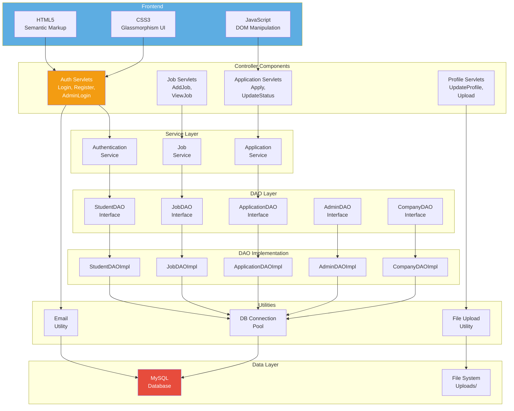
```mermaid
graph TB
    subgraph "Frontend"
        HTML["HTML5<br/>Semantic Markup"]
        CSS["CSS3<br/>Glassmorphism UI"]
        JS["JavaScript<br/>DOM Manipulation"]
    end
    
    subgraph "Controller Components"
        Auth["Auth Servlets<br/>Login, Register,<br/>AdminLogin"]
        Job["Job Servlets<br/>AddJob,<br/>ViewJob"]
        App["Application Servlets<br/>Apply,<br/>UpdateStatus"]
        Profile["Profile Servlets<br/>UpdateProfile,<br/>Upload"]
    end
    
    subgraph "Service Layer"
        AuthService["Authentication<br/>Service"]
        JobService["Job<br/>Service"]
        AppService["Application<br/>Service"]
    end
    
    subgraph "DAO Layer"
        StudentDAOI["StudentDAO<br/>Interface"]
        JobDAOI["JobDAO<br/>Interface"]
        AppDAOI["ApplicationDAO<br/>Interface"]
        AdminDAOI["AdminDAO<br/>Interface"]
        CompanyDAOI["CompanyDAO<br/>Interface"]
    end
    
    subgraph "DAO Implementation"
        StudentDAOImpl["StudentDAOImpl"]
        JobDAOImpl["JobDAOImpl"]
        AppDAOImpl["ApplicationDAOImpl"]
        AdminDAOImpl["AdminDAOImpl"]
        CompanyDAOImpl["CompanyDAOImpl"]
    end
    
    subgraph "Utilities"
        DBConn["DB Connection<br/>Pool"]
        EmailUtil["Email<br/>Utility"]
        FileUtil["File Upload<br/>Utility"]
    end
    
    subgraph "Data Layer"
        MySQL["MySQL<br/>Database"]
        FileSystem["File System<br/>Uploads/"]
    end
    
    HTML --> Auth
    JS --> App
    CSS --> Auth
    
    Auth --> AuthService
    Job --> JobService
    App --> AppService
    
    AuthService --> StudentDAOI
    JobService --> JobDAOI
    AppService --> AppDAOI
    
    StudentDAOI --> StudentDAOImpl
    JobDAOI --> JobDAOImpl
    AppDAOI --> AppDAOImpl
    AdminDAOI --> AdminDAOImpl
    CompanyDAOI --> CompanyDAOImpl
    
    StudentDAOImpl --> DBConn
    JobDAOImpl --> DBConn
    AppDAOImpl --> DBConn
    AdminDAOImpl --> DBConn
    CompanyDAOImpl --> DBConn
    
    DBConn --> MySQL
    Profile --> FileUtil
    FileUtil --> FileSystem
    
    Auth --> EmailUtil
    EmailUtil --> MySQL
    
    style Frontend fill:#5DADE2,color:#fff
    style Auth fill:#F39C12,color:#fff
    style MySQL fill:#E74C3C,color:#fff
```

---

## 9. DEPLOYMENT DIAGRAM (RUNTIME ENVIRONMENT) 🚀

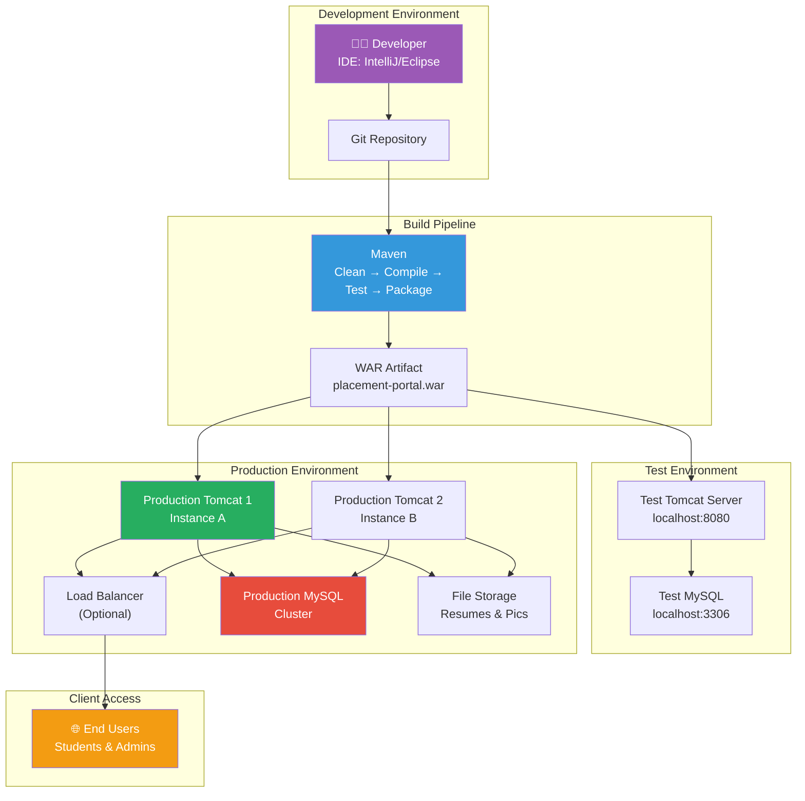
```mermaid
graph TB
    subgraph "Development Environment"
        Dev["👨‍💻 Developer<br/>IDE: IntelliJ/Eclipse"]
        Git["Git Repository"]
    end
    
    subgraph "Build Pipeline"
        Maven["Maven<br/>Clean → Compile →<br/>Test → Package"]
        WAR["WAR Artifact<br/>placement-portal.war"]
    end
    
    subgraph "Test Environment"
        TestTomcat["Test Tomcat Server<br/>localhost:8080"]
        TestDB["Test MySQL<br/>localhost:3306"]
    end
    
    subgraph "Production Environment"
        direction TB
        LB["Load Balancer<br/>(Optional)"]
        Prod1["Production Tomcat 1<br/>Instance A"]
        Prod2["Production Tomcat 2<br/>Instance B"]
        ProdDB["Production MySQL<br/>Cluster"]
        FileStore["File Storage<br/>Resumes & Pics"]
    end
    
    subgraph "Client Access"
        Users["🌐 End Users<br/>Students & Admins"]
    end
    
    Dev --> Git
    Git --> Maven
    Maven --> WAR
    WAR --> TestTomcat
    TestTomcat --> TestDB
    
    WAR --> Prod1
    WAR --> Prod2
    Prod1 --> LB
    Prod2 --> LB
    Prod1 --> ProdDB
    Prod2 --> ProdDB
    Prod1 --> FileStore
    Prod2 --> FileStore
    
    LB --> Users
    
    style Dev fill:#9B59B6,color:#fff
    style Maven fill:#3498DB,color:#fff
    style Prod1 fill:#27AE60,color:#fff
    style ProdDB fill:#E74C3C,color:#fff
    style Users fill:#F39C12,color:#fff
```

---

## 10. SEQUENCE DIAGRAMS (STEP-BY-STEP FLOWS) 📈

### 10.1 Student Registration Flow

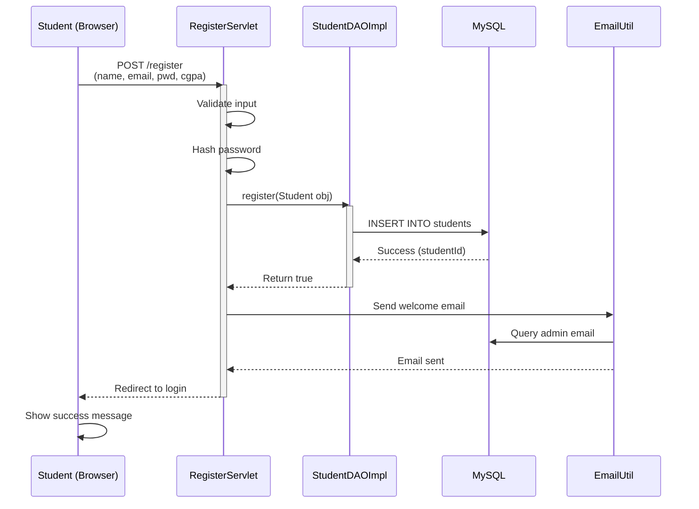
```mermaid
sequenceDiagram
    participant Student as Student (Browser)
    participant Register as RegisterServlet
    participant StudentDAO as StudentDAOImpl
    participant DB as MySQL
    participant Email as EmailUtil
    
    Student->>Register: POST /register<br/>(name, email, pwd, cgpa)
    
    activate Register
    Register->>Register: Validate input
    Register->>Register: Hash password
    Register->>StudentDAO: register(Student obj)
    
    activate StudentDAO
    StudentDAO->>DB: INSERT INTO students
    DB-->>StudentDAO: Success (studentId)
    StudentDAO-->>Register: Return true
    deactivate StudentDAO
    
    Register->>Email: Send welcome email
    Email->>DB: Query admin email
    Email-->>Register: Email sent
    
    Register-->>Student: Redirect to login
    deactivate Register
    Student->>Student: Show success message
```

### 10.2 Job Application Flow

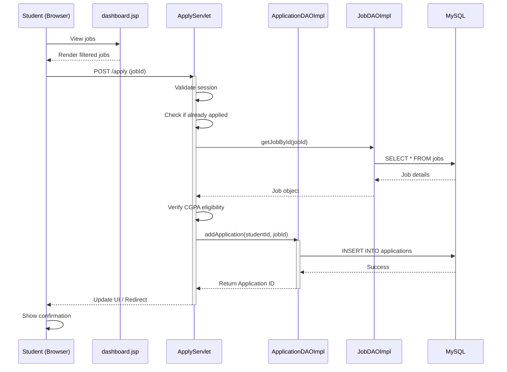
```mermaid
sequenceDiagram
    participant Student as Student (Browser)
    participant Dashboard as dashboard.jsp
    participant ApplyServlet as ApplyServlet
    participant AppDAO as ApplicationDAOImpl
    participant JobDAO as JobDAOImpl
    participant DB as MySQL
    
    Student->>Dashboard: View jobs
    Dashboard-->>Student: Render filtered jobs
    
    Student->>ApplyServlet: POST /apply (jobId)
    
    activate ApplyServlet
    ApplyServlet->>ApplyServlet: Validate session
    ApplyServlet->>ApplyServlet: Check if already applied
    
    ApplyServlet->>JobDAO: getJobById(jobId)
    JobDAO->>DB: SELECT * FROM jobs
    DB-->>JobDAO: Job details
    JobDAO-->>ApplyServlet: Job object
    
    ApplyServlet->>ApplyServlet: Verify CGPA eligibility
    
    ApplyServlet->>AppDAO: addApplication(studentId, jobId)
    activate AppDAO
    AppDAO->>DB: INSERT INTO applications
    DB-->>AppDAO: Success
    AppDAO-->>ApplyServlet: Return Application ID
    deactivate AppDAO
    
    ApplyServlet-->>Student: Update UI / Redirect
    deactivate ApplyServlet
    Student->>Student: Show confirmation
```

### 10.3 Admin Review & Update Application Status

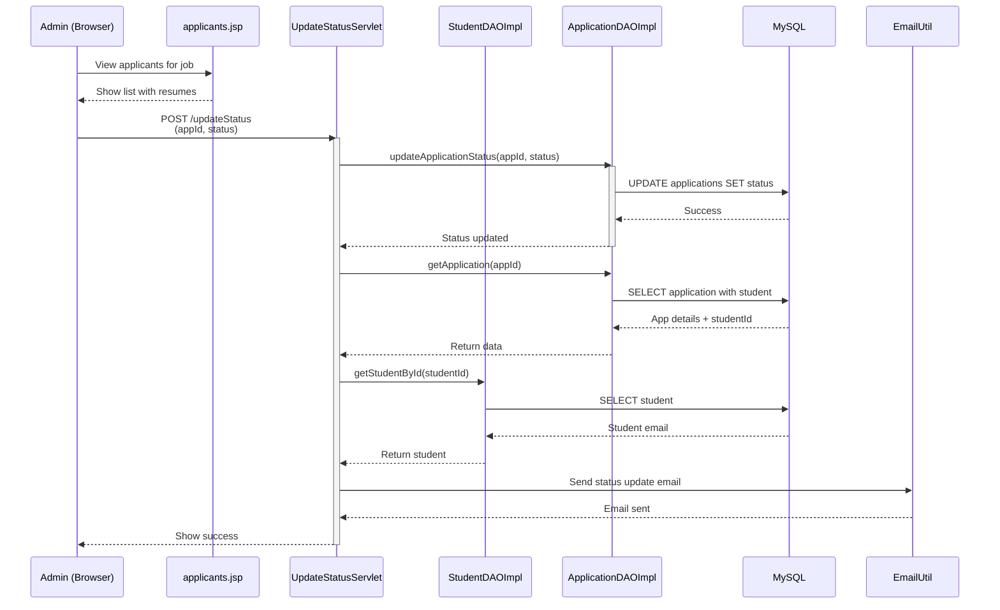
```mermaid
sequenceDiagram
    participant Admin as Admin (Browser)
    participant Applicants as applicants.jsp
    participant UpdateStatus as UpdateStatusServlet
    participant UserDAO as StudentDAOImpl
    participant AppDAO as ApplicationDAOImpl
    participant DB as MySQL
    participant Email as EmailUtil
    
    Admin->>Applicants: View applicants for job
    Applicants-->>Admin: Show list with resumes
    
    Admin->>UpdateStatus: POST /updateStatus<br/>(appId, status)
    
    activate UpdateStatus
    UpdateStatus->>AppDAO: updateApplicationStatus(appId, status)
    activate AppDAO
    AppDAO->>DB: UPDATE applications SET status
    DB-->>AppDAO: Success
    AppDAO-->>UpdateStatus: Status updated
    deactivate AppDAO
    
    UpdateStatus->>AppDAO: getApplication(appId)
    AppDAO->>DB: SELECT application with student
    DB-->>AppDAO: App details + studentId
    AppDAO-->>UpdateStatus: Return data
    
    UpdateStatus->>UserDAO: getStudentById(studentId)
    UserDAO->>DB: SELECT student
    DB-->>UserDAO: Student email
    UserDAO-->>UpdateStatus: Return student
    
    UpdateStatus->>Email: Send status update email
    Email-->>UpdateStatus: Email sent
    
    UpdateStatus-->>Admin: Show success
    deactivate UpdateStatus
```

### 10.4 Login Flow

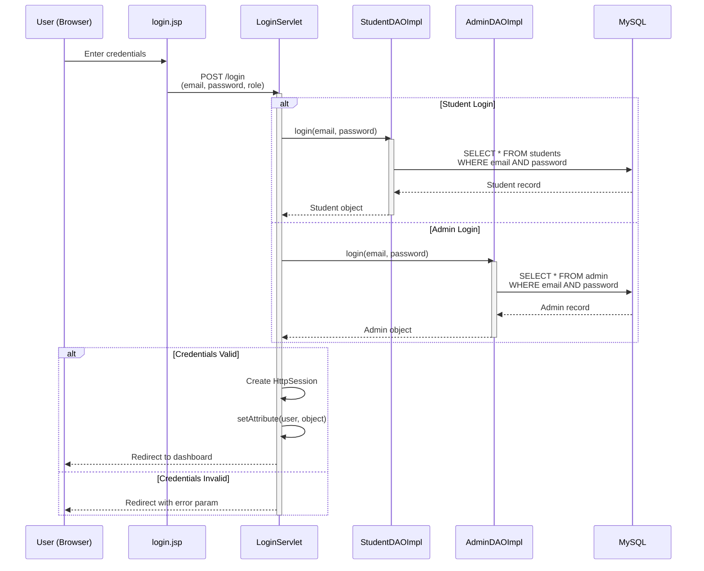
```mermaid
sequenceDiagram
    participant User as User (Browser)
    participant LoginPage as login.jsp
    participant LoginServlet as LoginServlet
    participant StudentDAO as StudentDAOImpl
    participant AdminDAO as AdminDAOImpl
    participant DB as MySQL
    
    User->>LoginPage: Enter credentials
    LoginPage->>LoginServlet: POST /login<br/>(email, password, role)
    
    activate LoginServlet
    
    alt Student Login
        LoginServlet->>StudentDAO: login(email, password)
        activate StudentDAO
        StudentDAO->>DB: SELECT * FROM students<br/>WHERE email AND password
        DB-->>StudentDAO: Student record
        StudentDAO-->>LoginServlet: Student object
        deactivate StudentDAO
    else Admin Login
        LoginServlet->>AdminDAO: login(email, password)
        activate AdminDAO
        AdminDAO->>DB: SELECT * FROM admin<br/>WHERE email AND password
        DB-->>AdminDAO: Admin record
        AdminDAO-->>LoginServlet: Admin object
        deactivate AdminDAO
    end
    
    alt Credentials Valid
        LoginServlet->>LoginServlet: Create HttpSession
        LoginServlet->>LoginServlet: setAttribute(user, object)
        LoginServlet-->>User: Redirect to dashboard
    else Credentials Invalid
        LoginServlet-->>User: Redirect with error param
    end
    
    deactivate LoginServlet
```

---

## 11. STATE DIAGRAMS (STATUS TRANSITIONS) ⚙️

### 11.1 Application Status State Machine

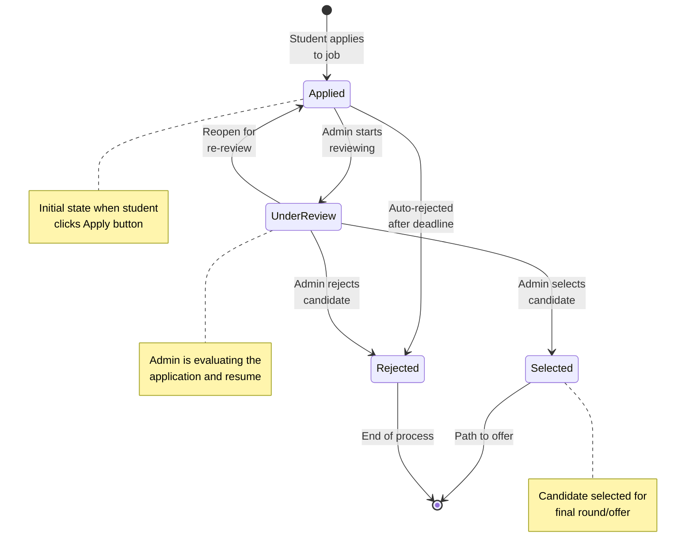
```mermaid
stateDiagram-v2
    [*] --> Applied: Student applies<br/>to job
    
    Applied --> UnderReview: Admin starts<br/>reviewing
    Applied --> Rejected: Auto-rejected<br/>after deadline
    
    UnderReview --> Selected: Admin selects<br/>candidate
    UnderReview --> Rejected: Admin rejects<br/>candidate
    UnderReview --> Applied: Reopen for<br/>re-review
    
    Selected --> [*]: Path to offer
    Rejected --> [*]: End of process
    
    note right of Applied
        Initial state when student
        clicks Apply button
    end note
    
    note right of UnderReview
        Admin is evaluating the
        application and resume
    end note
    
    note right of Selected
        Candidate selected for
        final round/offer
    end note
```

### 11.2 Job Posting Lifecycle

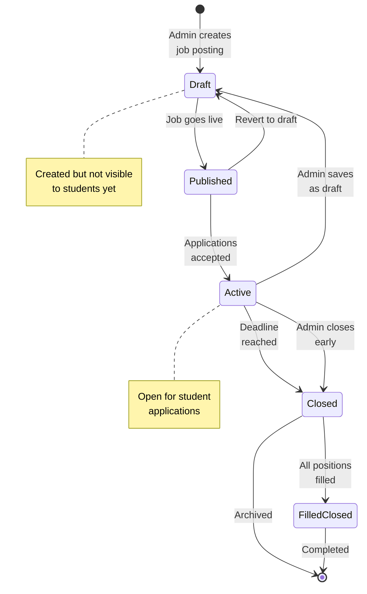
```mermaid
stateDiagram-v2
    [*] --> Draft: Admin creates<br/>job posting
    
    Draft --> Published: Job goes live
    Published --> Active: Applications<br/>accepted
    Active --> Closed: Deadline<br/>reached
    Closed --> FilledClosed: All positions<br/>filled
    
    Active --> Closed: Admin closes<br/>early
    Active --> Draft: Admin saves<br/>as draft
    
    Published --> Draft: Revert to draft
    
    Closed --> [*]: Archived
    FilledClosed --> [*]: Completed
    
    note right of Draft
        Created but not visible
        to students yet
    end note
    
    note right of Active
        Open for student
        applications
    end note
```

---

## 12. API FLOW DIAGRAM 🌐

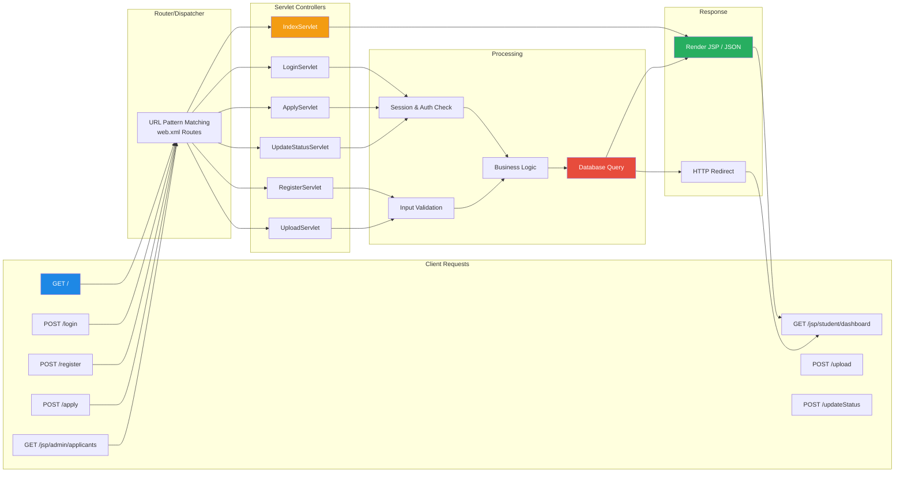
```mermaid
graph LR
    subgraph "Client Requests"
        R1["GET /"]
        R2["POST /login"]
        R3["POST /register"]
        R4["GET /jsp/student/dashboard"]
        R5["POST /apply"]
        R6["POST /upload"]
        R7["GET /jsp/admin/applicants"]
        R8["POST /updateStatus"]
    end
    
    subgraph "Router/Dispatcher"
        Router["URL Pattern Matching<br/>web.xml Routes"]
    end
    
    subgraph "Servlet Controllers"
        S1["IndexServlet"]
        S2["LoginServlet"]
        S3["RegisterServlet"]
        S4["ApplyServlet"]
        S5["UploadServlet"]
        S6["UpdateStatusServlet"]
    end
    
    subgraph "Processing"
        Auth["Session & Auth Check"]
        Validate["Input Validation"]
        Process["Business Logic"]
        DB["Database Query"]
    end
    
    subgraph "Response"
        JSP["Render JSP / JSON"]
        Redirect["HTTP Redirect"]
    end
    
    R1 --> Router
    R2 --> Router
    R3 --> Router
    R5 --> Router
    R7 --> Router
    
    Router --> S1
    Router --> S2
    Router --> S3
    Router --> S4
    Router --> S5
    Router --> S6
    
    S1 --> JSP
    S2 --> Auth
    S3 --> Validate
    S4 --> Auth
    S5 --> Validate
    S6 --> Auth
    
    Auth --> Process
    Validate --> Process
    
    Process --> DB
    DB --> JSP
    DB --> Redirect
    
    JSP --> R4
    Redirect --> R4
    
    style R1 fill:#1E88E5,color:#fff
    style S1 fill:#F39C12,color:#fff
    style DB fill:#E74C3C,color:#fff
    style JSP fill:#27AE60,color:#fff
```

---

## 13. PERFORMANCE & SCALABILITY STRATEGIES ⚡

### Database Indexing Strategy

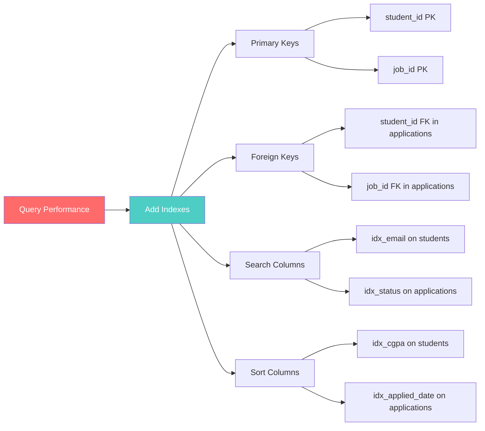
```mermaid
graph LR
    A["Query Performance"] --> B["Add Indexes"]
    B --> C["Primary Keys"]
    B --> D["Foreign Keys"]
    B --> E["Search Columns"]
    B --> F["Sort Columns"]
    
    C --> C1["student_id PK"]
    C --> C2["job_id PK"]
    
    D --> D1["student_id FK in applications"]
    D --> D2["job_id FK in applications"]
    
    E --> E1["idx_email on students"]
    E --> E2["idx_status on applications"]
    
    F --> F1["idx_cgpa on students"]
    F --> F2["idx_applied_date on applications"]
    
    style A fill:#FF6B6B,color:#fff
    style B fill:#4ECDC4,color:#fff
```

### Caching Strategy

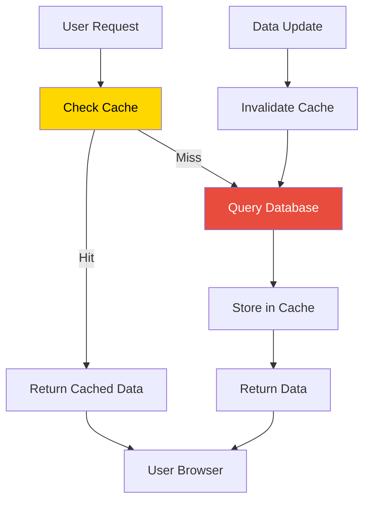
```mermaid
graph TB
    Request["User Request"] --> Cache["Check Cache"]
    
    Cache -->|Hit| Return1["Return Cached Data"]
    Cache -->|Miss| DB["Query Database"]
    
    DB --> Store["Store in Cache"]
    Store --> Return2["Return Data"]
    
    Return1 --> User["User Browser"]
    Return2 --> User
    
    Invalidate["Data Update"] --> Clear["Invalidate Cache"]
    Clear --> DB
    
    style Cache fill:#FFD700,color:#000
    style DB fill:#E74C3C,color:#fff
```

### Session Management

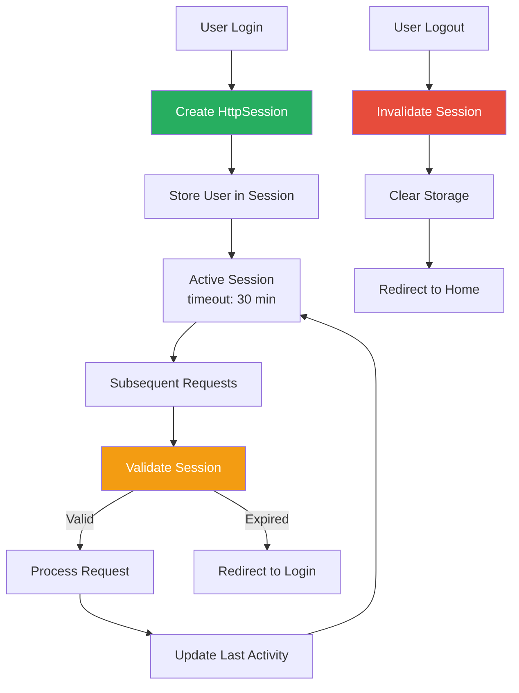
```mermaid
graph TB
    Login["User Login"] --> CreateSession["Create HttpSession"]
    CreateSession --> StoreData["Store User in Session"]
    
    StoreData --> Active["Active Session<br/>timeout: 30 min"]
    
    Active --> Request1["Subsequent Requests"]
    Request1 --> Validate["Validate Session"]
    Validate -->|Valid| Process["Process Request"]
    Validate -->|Expired| Redirect["Redirect to Login"]
    
    Process --> UpdateTime["Update Last Activity"]
    UpdateTime --> Active
    
    Logout["User Logout"] --> Invalidate["Invalidate Session"]
    Invalidate --> Clear["Clear Storage"]
    Clear --> End["Redirect to Home"]
    
    style CreateSession fill:#27AE60,color:#fff
    style Validate fill:#F39C12,color:#fff
    style Invalidate fill:#E74C3C,color:#fff
```

---

## 📚 DIAGRAM SUMMARY & QUICK REFERENCE

### Core Diagrams (What You Need to Know)

| # | Diagram | Purpose | Shows |
|---|---------|---------|-------|
| **1** | 🎯 **Use Case Diagram** | Actor interactions | Students & Admins doing tasks |
| **2** | 📊 **Activity Diagram** | Process workflow | Complete placement flow |
| **3** | 🔄 **Data Flow Diagram** | Information movement | Data between components |
| **4** | 🏗️ **System Architecture** | Layered design | Browser → Servlet → DAO → DB |
| **5** | 🎯 **MVC Pattern** | Web request cycle | Model, View, Controller flow |
| **6** | 🔧 **Class Diagram** | Java objects | Student, Job, Application classes |
| **7** | 🗄️ **ER Diagram** | Database design | 5 tables and relationships |
| **8** | 🔧 **Component Diagram** | System parts | Servlets, DAOs, JSPs, Database |
| **9** | 🚀 **Deployment Diagram** | Production setup | Tomcat → MySQL → Load Balancer |
| **10** | 📈 **Sequence Diagrams** | Step flows | 4 key workflows |
| **11** | ⚙️ **State Diagrams** | Status changes | Application & Job lifecycles |
| **12** | 🌐 **API Flow** | Endpoint routing | Request → Process → Response |
| **13** | ⚡ **Performance** | Optimization | Indexing, Caching, Sessions |

---

## ✅ What the Architecture Demonstrates

The **Ignite Placement Portal** architecture provides:

✅ **Clear Separation of Concerns** - MVC pattern with distinct layers  
✅ **Scalability** - Stateless servlets, connection pooling, database indexing  
✅ **Security** - Session management, password hashing, input validation  
✅ **Maintainability** - DAO pattern, interface-based design, reusable components  
✅ **Performance** - Caching, indexing, efficient queries  
✅ **Reliability** - Error handling, transaction management, graceful degradation

---

## 🎓 Key Takeaways

### Technology Stack
- **Frontend**: HTML5, CSS3, JavaScript (Native)
- **Backend**: Java Servlets, JSP (MVC)
- **Database**: MySQL with JDBC
- **Server**: Apache Tomcat 10+
- **Pattern**: DAO, Singleton, MVC

### Architecture Strengths
1. **Layered Architecture** - Easy to maintain and extend
2. **DAO Pattern** - Database independence
3. **Session Management** - Secure user authentication
4. **No External Frameworks** - Lightweight, fast, educational
5. **Database Design** - Proper normalization and relationships

### Scalability Features
- Connection pooling for database efficiency
- Stateless Controllers for horizontal scaling
- Database indexing for query performance
- Caching mechanisms for repeated data
- File upload handling with unique naming

### Security Features
- Password hashing with SHA256
- Prepared statements to prevent SQL injection
- Session validation on protected pages
- Email notifications for audit trail
- CGPA-based eligibility verification

---

## 🔗 Architecture Decision Records (ADR)

### Why MVC Pattern?
- Clear separation between UI, logic, and data
- Easy to test individual components
- Scalable for team development
- Industry standard for web applications

### Why DAO Pattern?
- Decouples business logic from database
- Easy to mock for testing
- Can switch databases without code changes
- Reusable across multiple servlets

### Why No Frameworks?
- Educational value (understand core concepts)
- Lightweight and fast
- Minimum dependencies
- Full control over request handling

### Why MySQL?
- ACID compliance for transactional integrity
- Relational model fits placement system perfectly
- Strong foreign key support
- Good indexing capabilities

---

## 📖 How to Read the Diagrams

### When Starting Development
1. **Start with Use Case** → Understand what users do
2. **Check ER Diagram** → See database structure
3. **Review Class Diagram** → Understand Java objects
4. **Study System Architecture** → See how components connect

### When Debugging
1. **Check Sequence Diagram** → Trace the flow
2. **Review State Diagram** → Understand valid states
3. **Check API Flow** → See request routing
4. **Use Component Diagram** → Locate component responsibility

### When Optimizing
1. **Check Performance Diagram** → See indexing strategy
2. **Review Data Flow** → Identify bottlenecks
3. **Study Deployment** → Plan scaling

---

